# Agent Development Project

## Executive Summary

This project contains two major development phases for building an intelligent agent system:

### Development Plan v1.0: OpenAI Agent SDK Foundation
**Goal**: Build a complete foundational agent framework with LLM integration and multi-agent orchestration.

**What it achieved**: A fully functional agent system featuring:
- **Core Agent Class** with async execution and tool integration
- **LLM Integration** using local Ollama phi4-mini model
- **Function Tool System** with automatic schema generation via `@function_tool` decorator
- **Multi-Agent Orchestration** with ContentPlanner and Writer agents
- **Comprehensive Error Handling** with logging and graceful failures
- **Execution Tracing & Monitoring** with performance metrics and dashboard
- **Web Search Capabilities** through DuckDuckGo integration

**Status**: ✅ **Complete** - All 10 versions (v0.1-v1.0) successfully implemented and tested

---

### Development Plan v2.0: PRE-BUNKER Health Communications System
**Goal**: Transform the agent foundation into a specialized "wind-tunnel" system for health communications that simulates audience reactions and prevents misinformation.

**What it builds**: A sophisticated health misinformation prevention system featuring:
- **Multi-Agent Audience Simulation** with diverse personas (vaccine-hesitant, health-anxious, chronic illness patients, healthcare professionals)
- **Advanced Claim Extraction** that identifies health claims with confidence scoring and risk assessment
- **Evidence Validation Gateway** that verifies claims against authoritative sources (WHO, CDC, Cochrane, FDA, PubMed)
- **Intelligent Countermeasure Studio** that generates persona-targeted prebunks and clarifications
- **Ops Orchestration** with human review queues, A/B testing, and learning systems

**Core Innovation**: The PRE-BUNKER pipeline processes health communications through 5 stages:
1. **Claim Extraction** - Identifies health claims and risk patterns
2. **Risk Scoring** - Assesses misinterpretation potential using medical accuracy criteria
3. **Persona Simulation** - Tests messages with different audience types to predict reactions
4. **Evidence Validation** - Links claims to authoritative health sources with trust scores
5. **Countermeasure Generation** - Creates targeted prebunks addressing specific persona concerns

**Status**: 🚧 **Extensively Implemented** - All 19 versions (v1.1-v2.0) have substantial implementations with some integration issues

---

## Bird's Eye View: See It In Action

Here's what our PRE-BUNKER system actually does, using a real example from our test logs:

### 🎯 **The Problem We're Solving**
Imagine a public health agency wants to share this message:
> *"The new COVID-19 vaccine is 100% safe and completely effective for everyone. It has no side effects and prevents all infections guaranteed."*

**The Risk**: This message uses dangerous absolute language ("100%", "guaranteed", "no side effects") that could backfire with different audiences.

### 🔬 **What Our System Does** (Step-by-Step Demo)

**Step 1: Smart Detection** 🔍
- **System finds**: 2 health claims in the message
- **Flags dangerous words**: "100% safe", "completely effective", "guaranteed", "no side effects"
- **Risk assessment**: 🔴 **HIGH RISK** - Absolutist language detected

**Step 2: Audience Simulation** 🎭
- **Tests message with 4 different personas**:
  - 😟 **Vaccine-Hesitant Parent**: "This sounds too good to be true, what are they hiding?"
  - 🏥 **Healthcare Professional**: "No medical intervention is 100% anything - this undermines credibility"
  - 📱 **Social Media User**: "Perfect for sharing, but friends will call this propaganda"
  - 👵 **Elderly Caregiver**: "I trust medical advice, but 'guaranteed' makes me suspicious"

**Step 3: Evidence Check** 📚
- **Searches trusted sources**: WHO, CDC, FDA, PubMed
- **Finds**: Real vaccine data shows 85-95% efficacy, rare side effects exist
- **Verdict**: Claims don't match authoritative evidence

**Step 4: Smart Fixes** 🛡️
- **Generates 2 improved versions**:
  - *"Clinical trials show the COVID-19 vaccine is highly effective (85-95%) with rare, manageable side effects. Most people experience significant protection."*
  - *"The COVID-19 vaccine provides strong protection for most people. Like all medical treatments, individual results may vary. Consult your healthcare provider."*

**Step 5: Final Report** 📊
```
🔴 Risk Assessment: HIGH RISK
📊 Claims: 2 total, 2 high-risk  
🎭 Personas: 4 analyzed (all showed concerns)
📚 Evidence: Claims don't match scientific data
🛡️ Countermeasures: 2 safer versions generated
⏱️ Analysis completed in 12.5 minutes
```

### 🎯 **The Result**
Instead of accidentally spreading a message that could damage trust, the health agency gets:
1. **Clear warning** about why the original message is risky
2. **Specific insights** on how different audiences will react
3. **Better alternatives** that maintain trust while conveying the same information
4. **Evidence-backed recommendations** from authoritative health sources

**This is PRE-BUNKING in action** - catching and fixing communication problems before they reach the public.

### 📊 **Visual Pipeline Flow**

Here's the complete process in one diagram, using our real COVID vaccine example:

```mermaid
graph TD
    A["📝 INPUT MESSAGE<br/>The new COVID-19 vaccine is 100% safe<br/>and completely effective for everyone.<br/>It has no side effects and prevents<br/>all infections guaranteed."] --> B["🔍 STEP 1: SMART DETECTION<br/>🚨 2 health claims found<br/>🚩 Dangerous words detected:<br/>• '100% safe'<br/>• 'completely effective'<br/>• 'guaranteed'<br/>• 'no side effects'<br/>📊 Risk Assessment: HIGH RISK"]
    
    B --> C["🎭 STEP 2: AUDIENCE SIMULATION<br/>Testing with 4 personas:<br/>😟 Vaccine-Hesitant: 'Sounds too good to be true'<br/>🏥 Healthcare Professional: 'Undermines credibility'<br/>📱 Social Media User: 'Friends will call this propaganda'<br/>👵 Elderly Caregiver: 'Guaranteed makes me suspicious'<br/>⚠️ ALL personas show concerns"]
    
    C --> D["📚 STEP 3: EVIDENCE CHECK<br/>Searching trusted sources:<br/>🌍 WHO: Global vaccine data<br/>🇺🇸 CDC: US safety monitoring<br/>📖 Cochrane: Systematic reviews<br/>💊 FDA: Clinical trial data<br/>🔬 PubMed: Peer-reviewed research<br/>❌ Claims don't match evidence<br/>✅ Real data: 85-95% efficacy, rare side effects"]
    
    D --> E["🛡️ STEP 4: SMART FIXES<br/>Generated 2 improved versions:<br/>📝 Version A: 'Clinical trials show<br/>the COVID-19 vaccine is highly effective<br/>(85-95%) with rare, manageable side effects.'<br/>📝 Version B: 'The COVID-19 vaccine provides<br/>strong protection for most people.<br/>Individual results may vary.'<br/>✅ Maintains message while building trust"]
    
    E --> F["📊 STEP 5: FINAL REPORT<br/>🔴 Risk Assessment: HIGH RISK<br/>📊 Claims: 2 total, 2 high-risk<br/>🎭 Personas: 4 analyzed (all concerned)<br/>📚 Evidence: Claims contradict data<br/>🛡️ Countermeasures: 2 safer versions<br/>⏱️ Analysis completed in 12.5 minutes<br/>✅ READY FOR HUMAN REVIEW"]
    
    F --> G["🎯 FINAL RESULT<br/>Health agency gets:<br/>⚠️ Clear warning about risks<br/>👥 Audience reaction insights<br/>📝 Better alternatives<br/>📚 Evidence-backed recommendations<br/>🚫 PREVENTS TRUST DAMAGE"]

    classDef inputBox fill:#ffebee,stroke:#d32f2f,stroke-width:2px,color:#000
    classDef processBox fill:#e3f2fd,stroke:#1976d2,stroke-width:2px,color:#000
    classDef warningBox fill:#fff3e0,stroke:#f57c00,stroke-width:2px,color:#000
    classDef successBox fill:#e8f5e8,stroke:#388e3c,stroke-width:2px,color:#000
    
    class A inputBox
    class B,C,D,E processBox
    class F warningBox
    class G successBox
```



---

## Going Deeper: Complete Feature Breakdown

Here's everything our system can do, what's working perfectly, what has issues, and what's partially implemented:

### 🔍 **1. Health Claim Detection & Analysis**

#### ✅ **Working Features**
- **Pattern Recognition**: Detects absolutist language ("100%", "always", "never", "guaranteed")
- **Medical Entity Extraction**: Identifies conditions (COVID-19, RSV), treatments (vaccines, medications), organizations (WHO, CDC)
- **LLM-Enhanced Detection**: Uses phi4-mini model to find implicit health claims
- **Claim Classification**: Categorizes as efficacy, safety, dosage, timing, causation claims
- **Risk Scoring**: Assigns 0.0-1.0 risk scores based on language patterns

#### ⚠️ **Partially Working**
- **Entity Coverage**: Only 33% of planned medical entities implemented
- **Complex Claims**: Struggles with multi-part claims and conditional statements

#### ❌ **Known Issues**
- **False Negatives**: Misses some subtle health claims in complex sentences

### 🎭 **2. Audience Persona Simulation**

#### ✅ **Working Personas** (12 total)
**Standard Personas (4):**
- **SkepticalParent**: Questions everything, wants proof
- **HealthAnxious**: Worries about side effects and risks  
- **TrustingElder**: Generally trusts medical authorities
- **BusyProfessional**: Wants quick, actionable information

**Health-Specific Personas (8):**
- **VaccineHesitant**: Prefers natural immunity, distrusts pharmaceutical industry
- **ChronicIllness**: Expert in their condition, concerned about interactions
- **HealthcareProfessional**: Evidence-based, liability-conscious
- **SocialMediaUser**: Influenced by peers, shares trending content
- **NewParent**: Child safety priority, researches everything
- **ElderlyCaregiver**: Manages multiple health conditions
- **FitnessEnthusiast**: Focused on performance and natural health
- **PregnantWoman**: Extremely cautious about any interventions

#### ✅ **Persona Capabilities**
- **Realistic Reactions**: Generates authentic responses based on persona characteristics
- **Concern Identification**: Identifies specific worries each persona would have
- **Risk Assessment**: Evaluates how each persona might misinterpret the message

#### ❌ **Known Issues**
- **Timeout Problems**: 25-40% of persona analyses fail due to connection timeouts
- **Incomplete Coverage**: Only 50% of personas have targeted countermeasures

### 📚 **3. Evidence Validation System**

#### ✅ **Trusted Source Integration**
- **WHO (World Health Organization)**: Authority score 0.95, global health guidelines
- **CDC (Centers for Disease Control)**: Authority score 0.95, US health policy
- **Cochrane**: Authority score 0.90, systematic reviews
- **FDA (Food & Drug Administration)**: Authority score 0.90, drug approvals
- **PubMed/NIH**: Authority score 0.85, peer-reviewed research

#### ✅ **Working Validation Features**
- **Source Matching**: Links health claims to relevant authoritative sources
- **Authority Scoring**: Weights evidence based on source credibility
- **Coverage Analysis**: Measures what percentage of claims have supporting evidence
- **Global Coverage**: Includes international health organizations

#### ❌ **Critical Issues**
- **False Positives**: Incorrectly marks obviously false claims (like "magical herbs cure everything") as "well_supported"
- **Over-broad Matching**: Search terms match too many irrelevant sources

### 🛡️ **4. Countermeasure Generation**

#### ✅ **Working Countermeasure Types**
- **Template Prebunks**: Pre-written responses for common problems
  - Absolutist Claims: "While X is helpful for many people, individual results may vary"
  - Safety Concerns: "Like all medical treatments, X has been extensively tested"
  - Missing Evidence: "Current research shows..." with appropriate caveats

- **Custom Prebunks**: AI-generated responses tailored to specific claims
- **Persona-Targeted**: Different versions for different audience types

#### ✅ **Generation Features**
- **Effectiveness Scoring**: Rates countermeasures on 0.0-1.0 effectiveness scale
- **Multiple Options**: Generates several alternatives per problematic claim
- **Evidence Integration**: Incorporates findings from validation step

#### ⚠️ **Partially Working**
- **Persona Coverage**: Only 6 out of 12 personas have specialized countermeasures
- **Quality Variation**: Some generated countermeasures are generic

### 📊 **5. Risk Assessment & Reporting**

#### ✅ **Working Risk Analysis**
- **Overall Risk Scoring**: Combines claim risk, persona concerns, evidence gaps
- **Risk Categorization**: Low/Medium/High/Critical risk levels
- **Key Findings Extraction**: Identifies most important issues
- **Priority Actions**: Suggests immediate steps to take

#### ✅ **Comprehensive Reporting**
- **Visual Risk Indicators**: 🟢 Low, 🟡 Medium, 🔴 High, ⚫ Critical
- **Detailed Breakdowns**: Shows exactly what triggered each risk assessment
- **Recommendations**: Specific actions to improve the message
- **Processing Metrics**: Shows analysis time and component performance

### 🌐 **6. Web Interface & API**

#### ✅ **Working Web Features**
- **FastAPI Application**: Modern web framework with automatic documentation
- **Message Input Forms**: Easy-to-use interface for submitting health messages
- **Results Display**: Formatted output showing risk analysis and suggestions
- **Enhanced Templates**: Professional-looking results pages

#### ✅ **API Endpoints**
- **POST /analyze**: Core analysis endpoint
- **GET /**: Home page with input form
- **GET /docs**: Automatic API documentation
- **Operations Dashboard**: Human review workflow interface

#### ⚠️ **Partial Features**
- **Authentication**: Basic HTTP auth for operations dashboard
- **Background Processing**: Some long-running analyses

### 🧪 **7. A/B Testing Framework**

#### ✅ **Working Testing Features**
- **Message Variants**: Generates alternative versions of health messages
- **Readability Scoring**: Measures how easy messages are to understand
- **Improvement Calculation**: Quantifies how much better new versions are
- **Comparison Reports**: Side-by-side analysis of original vs improved

#### ❌ **Known Issues**
- **Timeout Problems**: Same connection issues as persona system
- **Limited Variant Types**: Only basic readability improvements

### 📈 **8. Performance Metrics & Evaluation**

#### ✅ **Working Metrics**
- **Misinterpretability@K**: Measures how many people might misunderstand
- **Evidence Coverage Score**: Percentage of claims with supporting evidence  
- **Risk Reduction Score**: How much safer the improved version is
- **Response Time Tracking**: Processing speed measurements

#### ✅ **Evaluation Features**
- **Baseline Benchmarking**: Compares against standard health communication practices
- **Improvement Tracking**: Shows progress over time
- **Report Generation**: Detailed performance analyses

### 👥 **9. Human Review Workflow**

#### ✅ **Working Review Features**
- **Message Queue**: Prioritizes messages needing human review
- **Approval Workflow**: Human reviewers can approve/reject/modify
- **Feedback Integration**: Human feedback improves system performance
- **Priority Routing**: High-risk messages get immediate attention

#### ✅ **Operations Dashboard**
- **Review Interface**: Web-based tool for human reviewers
- **Message History**: Tracks all processed messages
- **Performance Monitoring**: Shows system health and metrics

### 🧠 **10. Learning & Adaptation System**

#### ✅ **Working Learning Features**
- **Feedback Processing**: Incorporates human reviewer feedback
- **Adaptive Scoring**: Adjusts risk scores based on outcomes
- **Pattern Recognition**: Learns from successful/failed communications
- **Recommendation Engine**: Suggests improvements based on historical data

#### ⚠️ **Partial Implementation**
- **Learning Speed**: Takes time to accumulate enough data for meaningful improvements

### ⚡ **Performance & Integration Status**

#### ❌ **Major Performance Issues**
- **Extremely Slow Processing**: 9-14 minutes per message (should be <30 seconds)
- **Connection Timeouts**: Frequent failures when processing multiple personas
- **Memory Usage**: Potential memory leaks during long processing sessions

#### ⚠️ **Integration Challenges**
- **API Contract Mismatches**: Some components expect different method signatures
- **Environment Dependencies**: Test success rate only 9.1% due to setup issues
- **Module Import Problems**: Python path configuration issues

#### ✅ **What's Solid**
- **Complete Architecture**: All major components implemented and connected
- **Rich Feature Set**: Comprehensive health communication analysis capabilities
- **Sophisticated Logging**: Detailed monitoring and debugging information
- **Modular Design**: Components can be improved independently

> 💡 **For Developers**: Complete technical analysis and priority fixes are in `agent-project/organize_me/PRIORITY_QUEUE.md`

### Technical Foundation
- **Language**: Python 3.13.7 with `uv` package management
- **LLM**: Local Ollama phi4-mini for privacy and control
- **Architecture**: Modular agent system with comprehensive error handling and tracing
- **Domain Focus**: Health communications with medical accuracy requirements
- **Deployment**: FastAPI web service with human review workflows

This project represents a complete evolution from general-purpose agent framework to specialized health misinformation prevention system, leveraging the robust foundation built in v1.0 to address critical public health communication challenges.